# Data

The data comes from [Kaggle ](https://www.kaggle.com/rush4ratio/video-game-sales-with-ratings#Video_Games_Sales_as_at_22_Dec_2016.csv) that was released in 2016. It is too old to study but there is no such available data that has similar features. For instance, [this one](https://www.kaggle.com/stpeteishii/video-game-sales-predict/data) could be an alternative that released few months ago but its features are not sufficient to build a predictive model.  


```r
# data from local file 
game <- read.csv("data/Video_Games_Sales_as_at_22_Dec_2016.csv", header = TRUE)

# libraries
library <- c("tidyverse", "tidymodels", "lubridate", "kableExtra", "vip")
sapply(library, require, character.only= TRUE)
```

```
##  tidyverse tidymodels  lubridate kableExtra        vip 
##       TRUE       TRUE       TRUE       TRUE       TRUE
```

```r
glimpse(game)
```

```
## Rows: 16,719
## Columns: 16
## $ Name            <chr> "Wii Sports", "Super Mario Bros.", "Mario Kart Wii", "…
## $ Platform        <chr> "Wii", "NES", "Wii", "Wii", "GB", "GB", "DS", "Wii", "…
## $ Year_of_Release <chr> "2006", "1985", "2008", "2009", "1996", "1989", "2006"…
## $ Genre           <chr> "Sports", "Platform", "Racing", "Sports", "Role-Playin…
## $ Publisher       <chr> "Nintendo", "Nintendo", "Nintendo", "Nintendo", "Ninte…
## $ NA_Sales        <dbl> 41.36, 29.08, 15.68, 15.61, 11.27, 23.20, 11.28, 13.96…
## $ EU_Sales        <dbl> 28.96, 3.58, 12.76, 10.93, 8.89, 2.26, 9.14, 9.18, 6.9…
## $ JP_Sales        <dbl> 3.77, 6.81, 3.79, 3.28, 10.22, 4.22, 6.50, 2.93, 4.70,…
## $ Other_Sales     <dbl> 8.45, 0.77, 3.29, 2.95, 1.00, 0.58, 2.88, 2.84, 2.24, …
## $ Global_Sales    <dbl> 82.53, 40.24, 35.52, 32.77, 31.37, 30.26, 29.80, 28.92…
## $ Critic_Score    <int> 76, NA, 82, 80, NA, NA, 89, 58, 87, NA, NA, 91, NA, 80…
## $ Critic_Count    <int> 51, NA, 73, 73, NA, NA, 65, 41, 80, NA, NA, 64, NA, 63…
## $ User_Score      <chr> "8", "", "8.3", "8", "", "", "8.5", "6.6", "8.4", "", …
## $ User_Count      <int> 322, NA, 709, 192, NA, NA, 431, 129, 594, NA, NA, 464,…
## $ Developer       <chr> "Nintendo", "", "Nintendo", "Nintendo", "", "", "Ninte…
## $ Rating          <chr> "E", "", "E", "E", "", "", "E", "E", "E", "", "", "E",…
```

```r
skimr::skim(game)
```


<table style='width: auto;'
        class='table table-condensed'>
<caption>Data summary</caption>
 <thead>
  <tr>
   <th style="text-align:left;">   </th>
   <th style="text-align:left;">   </th>
  </tr>
 </thead>
<tbody>
  <tr>
   <td style="text-align:left;"> Name </td>
   <td style="text-align:left;"> game </td>
  </tr>
  <tr>
   <td style="text-align:left;"> Number of rows </td>
   <td style="text-align:left;"> 16719 </td>
  </tr>
  <tr>
   <td style="text-align:left;"> Number of columns </td>
   <td style="text-align:left;"> 16 </td>
  </tr>
  <tr>
   <td style="text-align:left;"> _______________________ </td>
   <td style="text-align:left;">  </td>
  </tr>
  <tr>
   <td style="text-align:left;"> Column type frequency: </td>
   <td style="text-align:left;">  </td>
  </tr>
  <tr>
   <td style="text-align:left;"> character </td>
   <td style="text-align:left;"> 8 </td>
  </tr>
  <tr>
   <td style="text-align:left;"> numeric </td>
   <td style="text-align:left;"> 8 </td>
  </tr>
  <tr>
   <td style="text-align:left;"> ________________________ </td>
   <td style="text-align:left;">  </td>
  </tr>
  <tr>
   <td style="text-align:left;"> Group variables </td>
   <td style="text-align:left;"> None </td>
  </tr>
</tbody>
</table>


**Variable type: character**

<table>
 <thead>
  <tr>
   <th style="text-align:left;"> skim_variable </th>
   <th style="text-align:right;"> n_missing </th>
   <th style="text-align:right;"> complete_rate </th>
   <th style="text-align:right;"> min </th>
   <th style="text-align:right;"> max </th>
   <th style="text-align:right;"> empty </th>
   <th style="text-align:right;"> n_unique </th>
   <th style="text-align:right;"> whitespace </th>
  </tr>
 </thead>
<tbody>
  <tr>
   <td style="text-align:left;"> Name </td>
   <td style="text-align:right;"> 0 </td>
   <td style="text-align:right;"> 1 </td>
   <td style="text-align:right;"> 0 </td>
   <td style="text-align:right;"> 132 </td>
   <td style="text-align:right;"> 2 </td>
   <td style="text-align:right;"> 11563 </td>
   <td style="text-align:right;"> 0 </td>
  </tr>
  <tr>
   <td style="text-align:left;"> Platform </td>
   <td style="text-align:right;"> 0 </td>
   <td style="text-align:right;"> 1 </td>
   <td style="text-align:right;"> 2 </td>
   <td style="text-align:right;"> 4 </td>
   <td style="text-align:right;"> 0 </td>
   <td style="text-align:right;"> 31 </td>
   <td style="text-align:right;"> 0 </td>
  </tr>
  <tr>
   <td style="text-align:left;"> Year_of_Release </td>
   <td style="text-align:right;"> 0 </td>
   <td style="text-align:right;"> 1 </td>
   <td style="text-align:right;"> 3 </td>
   <td style="text-align:right;"> 4 </td>
   <td style="text-align:right;"> 0 </td>
   <td style="text-align:right;"> 40 </td>
   <td style="text-align:right;"> 0 </td>
  </tr>
  <tr>
   <td style="text-align:left;"> Genre </td>
   <td style="text-align:right;"> 0 </td>
   <td style="text-align:right;"> 1 </td>
   <td style="text-align:right;"> 0 </td>
   <td style="text-align:right;"> 12 </td>
   <td style="text-align:right;"> 2 </td>
   <td style="text-align:right;"> 13 </td>
   <td style="text-align:right;"> 0 </td>
  </tr>
  <tr>
   <td style="text-align:left;"> Publisher </td>
   <td style="text-align:right;"> 0 </td>
   <td style="text-align:right;"> 1 </td>
   <td style="text-align:right;"> 3 </td>
   <td style="text-align:right;"> 38 </td>
   <td style="text-align:right;"> 0 </td>
   <td style="text-align:right;"> 582 </td>
   <td style="text-align:right;"> 0 </td>
  </tr>
  <tr>
   <td style="text-align:left;"> User_Score </td>
   <td style="text-align:right;"> 0 </td>
   <td style="text-align:right;"> 1 </td>
   <td style="text-align:right;"> 0 </td>
   <td style="text-align:right;"> 3 </td>
   <td style="text-align:right;"> 6704 </td>
   <td style="text-align:right;"> 97 </td>
   <td style="text-align:right;"> 0 </td>
  </tr>
  <tr>
   <td style="text-align:left;"> Developer </td>
   <td style="text-align:right;"> 0 </td>
   <td style="text-align:right;"> 1 </td>
   <td style="text-align:right;"> 0 </td>
   <td style="text-align:right;"> 80 </td>
   <td style="text-align:right;"> 6623 </td>
   <td style="text-align:right;"> 1697 </td>
   <td style="text-align:right;"> 0 </td>
  </tr>
  <tr>
   <td style="text-align:left;"> Rating </td>
   <td style="text-align:right;"> 0 </td>
   <td style="text-align:right;"> 1 </td>
   <td style="text-align:right;"> 0 </td>
   <td style="text-align:right;"> 4 </td>
   <td style="text-align:right;"> 6769 </td>
   <td style="text-align:right;"> 9 </td>
   <td style="text-align:right;"> 0 </td>
  </tr>
</tbody>
</table>


**Variable type: numeric**

<table>
 <thead>
  <tr>
   <th style="text-align:left;"> skim_variable </th>
   <th style="text-align:right;"> n_missing </th>
   <th style="text-align:right;"> complete_rate </th>
   <th style="text-align:right;"> mean </th>
   <th style="text-align:right;"> sd </th>
   <th style="text-align:right;"> p0 </th>
   <th style="text-align:right;"> p25 </th>
   <th style="text-align:right;"> p50 </th>
   <th style="text-align:right;"> p75 </th>
   <th style="text-align:right;"> p100 </th>
   <th style="text-align:left;"> hist </th>
  </tr>
 </thead>
<tbody>
  <tr>
   <td style="text-align:left;"> NA_Sales </td>
   <td style="text-align:right;"> 0 </td>
   <td style="text-align:right;"> 1.00 </td>
   <td style="text-align:right;"> 0.26 </td>
   <td style="text-align:right;"> 0.81 </td>
   <td style="text-align:right;"> 0.00 </td>
   <td style="text-align:right;"> 0.00 </td>
   <td style="text-align:right;"> 0.08 </td>
   <td style="text-align:right;"> 0.24 </td>
   <td style="text-align:right;"> 41.36 </td>
   <td style="text-align:left;"> ▇▁▁▁▁ </td>
  </tr>
  <tr>
   <td style="text-align:left;"> EU_Sales </td>
   <td style="text-align:right;"> 0 </td>
   <td style="text-align:right;"> 1.00 </td>
   <td style="text-align:right;"> 0.15 </td>
   <td style="text-align:right;"> 0.50 </td>
   <td style="text-align:right;"> 0.00 </td>
   <td style="text-align:right;"> 0.00 </td>
   <td style="text-align:right;"> 0.02 </td>
   <td style="text-align:right;"> 0.11 </td>
   <td style="text-align:right;"> 28.96 </td>
   <td style="text-align:left;"> ▇▁▁▁▁ </td>
  </tr>
  <tr>
   <td style="text-align:left;"> JP_Sales </td>
   <td style="text-align:right;"> 0 </td>
   <td style="text-align:right;"> 1.00 </td>
   <td style="text-align:right;"> 0.08 </td>
   <td style="text-align:right;"> 0.31 </td>
   <td style="text-align:right;"> 0.00 </td>
   <td style="text-align:right;"> 0.00 </td>
   <td style="text-align:right;"> 0.00 </td>
   <td style="text-align:right;"> 0.04 </td>
   <td style="text-align:right;"> 10.22 </td>
   <td style="text-align:left;"> ▇▁▁▁▁ </td>
  </tr>
  <tr>
   <td style="text-align:left;"> Other_Sales </td>
   <td style="text-align:right;"> 0 </td>
   <td style="text-align:right;"> 1.00 </td>
   <td style="text-align:right;"> 0.05 </td>
   <td style="text-align:right;"> 0.19 </td>
   <td style="text-align:right;"> 0.00 </td>
   <td style="text-align:right;"> 0.00 </td>
   <td style="text-align:right;"> 0.01 </td>
   <td style="text-align:right;"> 0.03 </td>
   <td style="text-align:right;"> 10.57 </td>
   <td style="text-align:left;"> ▇▁▁▁▁ </td>
  </tr>
  <tr>
   <td style="text-align:left;"> Global_Sales </td>
   <td style="text-align:right;"> 0 </td>
   <td style="text-align:right;"> 1.00 </td>
   <td style="text-align:right;"> 0.53 </td>
   <td style="text-align:right;"> 1.55 </td>
   <td style="text-align:right;"> 0.01 </td>
   <td style="text-align:right;"> 0.06 </td>
   <td style="text-align:right;"> 0.17 </td>
   <td style="text-align:right;"> 0.47 </td>
   <td style="text-align:right;"> 82.53 </td>
   <td style="text-align:left;"> ▇▁▁▁▁ </td>
  </tr>
  <tr>
   <td style="text-align:left;"> Critic_Score </td>
   <td style="text-align:right;"> 8582 </td>
   <td style="text-align:right;"> 0.49 </td>
   <td style="text-align:right;"> 68.97 </td>
   <td style="text-align:right;"> 13.94 </td>
   <td style="text-align:right;"> 13.00 </td>
   <td style="text-align:right;"> 60.00 </td>
   <td style="text-align:right;"> 71.00 </td>
   <td style="text-align:right;"> 79.00 </td>
   <td style="text-align:right;"> 98.00 </td>
   <td style="text-align:left;"> ▁▁▅▇▃ </td>
  </tr>
  <tr>
   <td style="text-align:left;"> Critic_Count </td>
   <td style="text-align:right;"> 8582 </td>
   <td style="text-align:right;"> 0.49 </td>
   <td style="text-align:right;"> 26.36 </td>
   <td style="text-align:right;"> 18.98 </td>
   <td style="text-align:right;"> 3.00 </td>
   <td style="text-align:right;"> 12.00 </td>
   <td style="text-align:right;"> 21.00 </td>
   <td style="text-align:right;"> 36.00 </td>
   <td style="text-align:right;"> 113.00 </td>
   <td style="text-align:left;"> ▇▃▂▁▁ </td>
  </tr>
  <tr>
   <td style="text-align:left;"> User_Count </td>
   <td style="text-align:right;"> 9129 </td>
   <td style="text-align:right;"> 0.45 </td>
   <td style="text-align:right;"> 162.23 </td>
   <td style="text-align:right;"> 561.28 </td>
   <td style="text-align:right;"> 4.00 </td>
   <td style="text-align:right;"> 10.00 </td>
   <td style="text-align:right;"> 24.00 </td>
   <td style="text-align:right;"> 81.00 </td>
   <td style="text-align:right;"> 10665.00 </td>
   <td style="text-align:left;"> ▇▁▁▁▁ </td>
  </tr>
</tbody>
</table>

The data has 16 variables, 8 numeric and 8 in character format. While no missing data appears in categorical data, three of the numeric variables suffer from the huge amount of missing values.  


# Data Prepation and EDA

Since it is a small demonstration, I will just remove observations with missing values. However, in the real life situation, it might worth to analyze what type of observations are missing, are they random or systematic?  It may require additional computation if you need to preserve those observations. For the some part of the EDA analysis and graphs, the book of [Xijin Ge, Jianli Qi and Rong Fan](https://gexijin.github.io/learnR/index.html) is very helpful.They demonstrated different examples to faciliated learning of R programming. 

### basic imputations 
We can start first with the numeric variables. To match the units of critic scores with user scores , I divided it to 10 and then converted other variables into numeric types. 


```r
game <- na.omit(game)  # Remove NA in data

game <-  game %>%
        mutate(Critic_Score= as.numeric(as.character(game$Critic_Score)) / 10, # same decimal as user score now
               User_Score = as.numeric(as.character(game$User_Score)), # character in data
               Critic_Count = as.numeric(game$Critic_Count),
               User_Count = as.numeric(game$User_Count))
```

### Initial graphs 

Here you can see the distribution of global sales, game release years, and which game was on the first rank of that year. 


```r
# global sales
game %>%
        group_by(Year_of_Release) %>%
        summarize(Sales = sum(Global_Sales), na.rm = TRUE) %>%
        ggplot(aes(x = Year_of_Release, y = Sales)) +
        geom_col(fill = "navyblue") +
        theme_bw()+
        theme(axis.text.x = element_text(angle = 90)) +
        labs(title = "Global Sales Histograms", x = "Year", y = "Sales (units)")
```

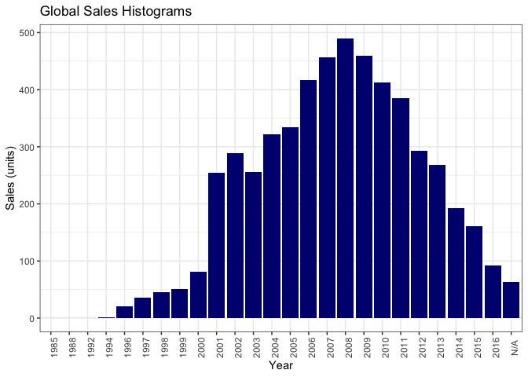<!-- -->

```r
# Game release years
game %>%
        group_by(Year_of_Release) %>%
        summarize(Number_of_Games = n()) %>%
        ggplot(aes(x = Year_of_Release, y = Number_of_Games)) +
        geom_col(fill = "magenta4") +
        theme_bw()+
        theme(axis.text.x = element_text(angle = 90)) +
        labs(title = "Games released per Year", x = "Year", y = "Sales (units)")
```

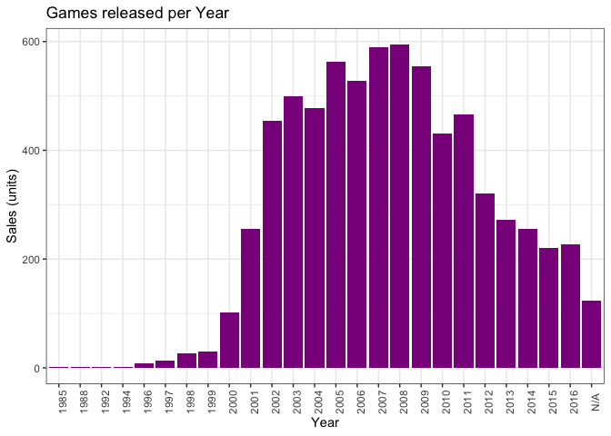<!-- -->

```r
# Top Global Sales each year
game %>%
        group_by(Year_of_Release, Publisher) %>%
        summarize(Sales = sum(Global_Sales)) %>%
        top_n(n = 1) %>%
        kable() %>% kable_styling()
```

```
## `summarise()` has grouped output by 'Year_of_Release'. You can override using the `.groups` argument.
```

```
## Selecting by Sales
```

<table class="table" style="margin-left: auto; margin-right: auto;">
 <thead>
  <tr>
   <th style="text-align:left;"> Year_of_Release </th>
   <th style="text-align:left;"> Publisher </th>
   <th style="text-align:right;"> Sales </th>
  </tr>
 </thead>
<tbody>
  <tr>
   <td style="text-align:left;"> 1985 </td>
   <td style="text-align:left;"> Activision </td>
   <td style="text-align:right;"> 0.03 </td>
  </tr>
  <tr>
   <td style="text-align:left;"> 1988 </td>
   <td style="text-align:left;"> Maxis </td>
   <td style="text-align:right;"> 0.03 </td>
  </tr>
  <tr>
   <td style="text-align:left;"> 1992 </td>
   <td style="text-align:left;"> id Software </td>
   <td style="text-align:right;"> 0.03 </td>
  </tr>
  <tr>
   <td style="text-align:left;"> 1994 </td>
   <td style="text-align:left;"> Sony Computer Entertainment </td>
   <td style="text-align:right;"> 1.27 </td>
  </tr>
  <tr>
   <td style="text-align:left;"> 1996 </td>
   <td style="text-align:left;"> Sony Computer Entertainment </td>
   <td style="text-align:right;"> 7.66 </td>
  </tr>
  <tr>
   <td style="text-align:left;"> 1997 </td>
   <td style="text-align:left;"> Sony Computer Entertainment </td>
   <td style="text-align:right;"> 22.79 </td>
  </tr>
  <tr>
   <td style="text-align:left;"> 1998 </td>
   <td style="text-align:left;"> Sony Computer Entertainment </td>
   <td style="text-align:right;"> 15.67 </td>
  </tr>
  <tr>
   <td style="text-align:left;"> 1999 </td>
   <td style="text-align:left;"> Sony Computer Entertainment </td>
   <td style="text-align:right;"> 17.84 </td>
  </tr>
  <tr>
   <td style="text-align:left;"> 2000 </td>
   <td style="text-align:left;"> Electronic Arts </td>
   <td style="text-align:right;"> 16.80 </td>
  </tr>
  <tr>
   <td style="text-align:left;"> 2001 </td>
   <td style="text-align:left;"> Sony Computer Entertainment </td>
   <td style="text-align:right;"> 40.04 </td>
  </tr>
  <tr>
   <td style="text-align:left;"> 2002 </td>
   <td style="text-align:left;"> Electronic Arts </td>
   <td style="text-align:right;"> 66.72 </td>
  </tr>
  <tr>
   <td style="text-align:left;"> 2003 </td>
   <td style="text-align:left;"> Electronic Arts </td>
   <td style="text-align:right;"> 67.86 </td>
  </tr>
  <tr>
   <td style="text-align:left;"> 2004 </td>
   <td style="text-align:left;"> Electronic Arts </td>
   <td style="text-align:right;"> 62.30 </td>
  </tr>
  <tr>
   <td style="text-align:left;"> 2005 </td>
   <td style="text-align:left;"> Nintendo </td>
   <td style="text-align:right;"> 94.52 </td>
  </tr>
  <tr>
   <td style="text-align:left;"> 2006 </td>
   <td style="text-align:left;"> Nintendo </td>
   <td style="text-align:right;"> 177.06 </td>
  </tr>
  <tr>
   <td style="text-align:left;"> 2007 </td>
   <td style="text-align:left;"> Nintendo </td>
   <td style="text-align:right;"> 92.49 </td>
  </tr>
  <tr>
   <td style="text-align:left;"> 2008 </td>
   <td style="text-align:left;"> Nintendo </td>
   <td style="text-align:right;"> 83.29 </td>
  </tr>
  <tr>
   <td style="text-align:left;"> 2009 </td>
   <td style="text-align:left;"> Nintendo </td>
   <td style="text-align:right;"> 103.35 </td>
  </tr>
  <tr>
   <td style="text-align:left;"> 2010 </td>
   <td style="text-align:left;"> Electronic Arts </td>
   <td style="text-align:right;"> 70.86 </td>
  </tr>
  <tr>
   <td style="text-align:left;"> 2011 </td>
   <td style="text-align:left;"> Electronic Arts </td>
   <td style="text-align:right;"> 54.25 </td>
  </tr>
  <tr>
   <td style="text-align:left;"> 2012 </td>
   <td style="text-align:left;"> Activision </td>
   <td style="text-align:right;"> 47.44 </td>
  </tr>
  <tr>
   <td style="text-align:left;"> 2013 </td>
   <td style="text-align:left;"> Take-Two Interactive </td>
   <td style="text-align:right;"> 51.34 </td>
  </tr>
  <tr>
   <td style="text-align:left;"> 2014 </td>
   <td style="text-align:left;"> Ubisoft </td>
   <td style="text-align:right;"> 31.49 </td>
  </tr>
  <tr>
   <td style="text-align:left;"> 2015 </td>
   <td style="text-align:left;"> Electronic Arts </td>
   <td style="text-align:right;"> 23.54 </td>
  </tr>
  <tr>
   <td style="text-align:left;"> 2016 </td>
   <td style="text-align:left;"> Electronic Arts </td>
   <td style="text-align:right;"> 25.05 </td>
  </tr>
  <tr>
   <td style="text-align:left;"> N/A </td>
   <td style="text-align:left;"> Electronic Arts </td>
   <td style="text-align:right;"> 16.91 </td>
  </tr>
</tbody>
</table>

### Age of games 
The release year of the games are available in data and we can create a new variable as the age of games. 


```r
# we can create a new variable as age of game
game <- game %>%
        mutate(Age = 2018 - as.numeric(game$Year_of_Release)) 
```

```
## Warning in mask$eval_all_mutate(quo): NAs introduced by coercion
```

The distribution of user and critic counts are so skewed, which leads me to take their log. Moreover, the value of global sales are not in their true unit, I also multiply it with 1000000. Nevertheless, this one also so skewed but I will take its log in modeling stage. 


```r
# log Critic and user counts sincethey are skewed 
game <- game %>%
        mutate(Global_Sales = Global_Sales * 1000000) %>% # actual sales
        mutate(Critic.Count.Log = log(Critic_Count),
               User.Count.Log = log(User_Count)
                )
```

### Distibution of continious variables 
Finally, we can create histogram and qqplot and look at their distribution, and examine shapiro.test results for each numeric variables. 


```r
# brings all numeric columns' name
chrs <- sapply(game, is.numeric)
name <- names(game[, chrs])

par(mfrow = c(4, 4))    # Layout outputs in 4 rows and 4 columns

for (i in 1:length(name)){
        sub <- sample(game[name[i]][, 1], 5000)
        submean <- mean(sub)
        hist(sub, main = paste("Hist. of", name[i], sep = " "), xlab = name[i])
        abline(v = submean, col = "blue", lwd = 1)
        qqnorm(sub, main = paste("Q-Q Plot of", name[i], sep = " "))
        qqline(sub) 
        if (i == 1) {s.t <- shapiro.test(sub)
        } else {s.t <- rbind(s.t, shapiro.test(sub))
        }
}
```

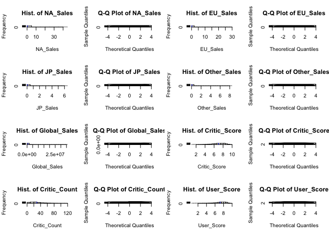<!-- -->

```r
s.t <- s.t[, 1:2]  # Take first two columns of shapiro.test result
s.t <- cbind(name, s.t) # Add variable name for the result
s.t
```

```
##     name               statistic p.value     
## s.t "NA_Sales"         0.3077091 2.419903e-87
##     "EU_Sales"         0.2608094 7.879314e-89
##     "JP_Sales"         0.2097699 2.335325e-90
##     "Other_Sales"      0.2576479 6.298046e-89
##     "Global_Sales"     0.3771554 5.692853e-85
##     "Critic_Score"     0.9649777 3.41328e-33 
##     "Critic_Count"     0.9206797 2.161182e-45
##     "User_Score"       0.9137344 9.326539e-47
##     "User_Count"       0.2738463 2.002176e-88
##     "Age"              0.9812175 5.07078e-25 
##     "Critic.Count.Log" 0.9783622 6.157508e-27
##     "User.Count.Log"   0.9447311 9.345529e-40
```

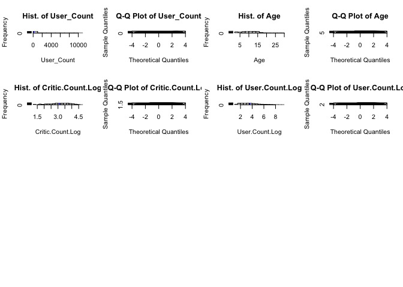<!-- -->


### Platforms 

First of all, let's check out distribution of games according to platforms. I also combine sub platforms with their main sources. As seen, most of the games were sold in Playstation platform, following by Nintendo and Xbox. The results show that people tend to play games mainly in these tree platforms.

 


```r
################ Platforms

# Regroup platform as Platform.type 
pc <- c("PC")
xbox <- c("X360", "XB", "XOne")
nintendo <- c("Wii", "WiiU", "N64", "GC", "NES", "3DS", "DS") 
playstation <- c("PS", "PS2", "PS3", "PS4", "PSP", "PSV")
game <- game %>%
        mutate(Platform.type = ifelse(Platform %in% pc, "PC",
                                      ifelse(Platform %in% xbox, "Xbox",
                                             ifelse(Platform %in% nintendo, "Nintendo", 
                                                    ifelse(Platform %in% playstation, "Playstation", "Others"))))) 


# plot
ggplot(game, aes(x = Platform.type)) + geom_bar(fill = "blue") +
        theme_minimal()
```

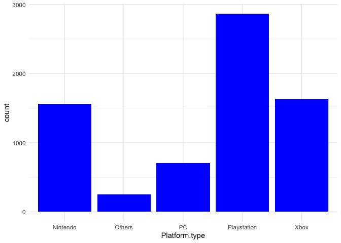<!-- -->

### Ratings

I also follow a similar approach here. First, I delete levels if they are empty in ratings and later I merged rare ratings with most relevant ones. Finally, you can see their distribution in mosaic plot. 


```r
game <- game %>% filter(Rating != "") %>% droplevels()  #remove empty rating observations

table(game$Rating)
```

```
## 
##   AO    E E10+  K-A    M   RP    T 
##    1 2118  946    1 1459    2 2420
```

```r
# collapse rare Ratings
game <- game %>% mutate(Rating = ifelse(Rating == "AO", "M", Rating),
                        Rating = ifelse(Rating == "K-A", "E", Rating),
                        Rating = ifelse(Rating == "RP", "E", Rating))

table(game$Rating)
```

```
## 
##    E E10+    M    T 
## 2121  946 1460 2420
```

```r
library(ggmosaic)
library(plotly)
```

```
## 
## Attaching package: 'plotly'
```

```
## The following object is masked from 'package:ggplot2':
## 
##     last_plot
```

```
## The following object is masked from 'package:stats':
## 
##     filter
```

```
## The following object is masked from 'package:graphics':
## 
##     layout
```

```r
p <- ggplot(game) +
        geom_mosaic(aes(x = product(Rating), fill = Platform.type), na.rm = TRUE) +
        labs(x = "Rating Type", y = "Platform Type", title="Mosaic Plot") +
        theme(axis.text.y = element_blank())
ggplotly(p)
```

```{=html}
<div id="htmlwidget-5a58caaaaaff6eb64513" style="width:672px;height:480px;" class="plotly html-widget"></div>
<script type="application/json" data-for="htmlwidget-5a58caaaaaff6eb64513">{"x":{"data":[{"x":[0,0,0.296152295955089,0.296152295955089,0],"y":[0,0.302027230845119,0.302027230845119,0,0],"text":"Nintendo<br>E<br>Frequency: 666","key":["Nintendo","E"],"type":"scatter","mode":"lines","line":{"width":0.377952755905512,"color":"transparent","dash":"solid"},"fill":"toself","fillcolor":"rgba(248,118,109,0.8)","hoveron":"fills","name":"Nintendo","legendgroup":"Nintendo","showlegend":true,"xaxis":"x","yaxis":"y","hoverinfo":"text","_isSimpleKey":true,"_isNestedKey":false,"frame":null},{"x":[0.306152295955089,0.306152295955089,0.438240967324025,0.438240967324025,0.306152295955089],"y":[0,0.390438493265526,0.390438493265526,0,0],"text":"Nintendo<br>E10+<br>Frequency: 384","key":["Nintendo","E10+"],"type":"scatter","mode":"lines","line":{"width":0.377952755905512,"color":"transparent","dash":"solid"},"fill":"toself","fillcolor":"rgba(248,118,109,0.8)","hoveron":"fills","name":"Nintendo","legendgroup":"Nintendo","showlegend":false,"xaxis":"x","yaxis":"y","hoverinfo":"text","_isSimpleKey":true,"_isNestedKey":false,"frame":null},{"x":[0.448240967324025,0.448240967324025,0.652098747660861,0.652098747660861,0.448240967324025],"y":[0,0.0645633059247653,0.0645633059247653,0,0],"text":"Nintendo<br>M<br>Frequency: 98","key":["Nintendo","M"],"type":"scatter","mode":"lines","line":{"width":0.377952755905512,"color":"transparent","dash":"solid"},"fill":"toself","fillcolor":"rgba(248,118,109,0.8)","hoveron":"fills","name":"Nintendo","legendgroup":"Nintendo","showlegend":false,"xaxis":"x","yaxis":"y","hoverinfo":"text","_isSimpleKey":true,"_isNestedKey":false,"frame":null},{"x":[0.662098747660861,0.662098747660861,1,1,0.662098747660861],"y":[0,0.164152395878373,0.164152395878373,0,0],"text":"Nintendo<br>T<br>Frequency: 413","key":["Nintendo","T"],"type":"scatter","mode":"lines","line":{"width":0.377952755905512,"color":"transparent","dash":"solid"},"fill":"toself","fillcolor":"rgba(248,118,109,0.8)","hoveron":"fills","name":"Nintendo","legendgroup":"Nintendo","showlegend":false,"xaxis":"x","yaxis":"y","hoverinfo":"text","_isSimpleKey":true,"_isNestedKey":false,"frame":null},{"x":[0,0,0.296152295955089,0.296152295955089,0],"y":[0.311561856737575,0.391376860684633,0.391376860684633,0.311561856737575,0.311561856737575],"text":"Others<br>E<br>Frequency: 176","key":["Others","E"],"type":"scatter","mode":"lines","line":{"width":0.377952755905512,"color":"transparent","dash":"solid"},"fill":"toself","fillcolor":"rgba(163,165,0,0.8)","hoveron":"fills","name":"Others","legendgroup":"Others","showlegend":true,"xaxis":"x","yaxis":"y","hoverinfo":"text","_isSimpleKey":true,"_isNestedKey":false,"frame":null},{"x":[0.306152295955089,0.306152295955089,0.438240967324025,0.438240967324025,0.306152295955089],"y":[0.399973119157982,0.418274923529804,0.418274923529804,0.399973119157982,0.399973119157982],"text":"Others<br>E10+<br>Frequency: 18","key":["Others","E10+"],"type":"scatter","mode":"lines","line":{"width":0.377952755905512,"color":"transparent","dash":"solid"},"fill":"toself","fillcolor":"rgba(163,165,0,0.8)","hoveron":"fills","name":"Others","legendgroup":"Others","showlegend":false,"xaxis":"x","yaxis":"y","hoverinfo":"text","_isSimpleKey":true,"_isNestedKey":false,"frame":null},{"x":[0.448240967324025,0.448240967324025,0.652098747660861,0.652098747660861,0.448240967324025],"y":[0.0740979318172212,0.078709596526133,0.078709596526133,0.0740979318172212,0.0740979318172212],"text":"Others<br>M<br>Frequency: 7","key":["Others","M"],"type":"scatter","mode":"lines","line":{"width":0.377952755905512,"color":"transparent","dash":"solid"},"fill":"toself","fillcolor":"rgba(163,165,0,0.8)","hoveron":"fills","name":"Others","legendgroup":"Others","showlegend":false,"xaxis":"x","yaxis":"y","hoverinfo":"text","_isSimpleKey":true,"_isNestedKey":false,"frame":null},{"x":[0.662098747660861,0.662098747660861,1,1,0.662098747660861],"y":[0.173687021770829,0.195150046897783,0.195150046897783,0.173687021770829,0.173687021770829],"text":"Others<br>T<br>Frequency: 54","key":["Others","T"],"type":"scatter","mode":"lines","line":{"width":0.377952755905512,"color":"transparent","dash":"solid"},"fill":"toself","fillcolor":"rgba(163,165,0,0.8)","hoveron":"fills","name":"Others","legendgroup":"Others","showlegend":false,"xaxis":"x","yaxis":"y","hoverinfo":"text","_isSimpleKey":true,"_isNestedKey":false,"frame":null},{"x":[0,0,0.296152295955089,0.296152295955089,0],"y":[0.400911486577089,0.447167909319135,0.447167909319135,0.400911486577089,0.400911486577089],"text":"PC<br>E<br>Frequency: 102","key":["PC","E"],"type":"scatter","mode":"lines","line":{"width":0.377952755905512,"color":"transparent","dash":"solid"},"fill":"toself","fillcolor":"rgba(0,191,125,0.8)","hoveron":"fills","name":"PC","legendgroup":"PC","showlegend":true,"xaxis":"x","yaxis":"y","hoverinfo":"text","_isSimpleKey":true,"_isNestedKey":false,"frame":null},{"x":[0.306152295955089,0.306152295955089,0.438240967324025,0.438240967324025,0.306152295955089],"y":[0.427809549422259,0.493899398542726,0.493899398542726,0.427809549422259,0.427809549422259],"text":"PC<br>E10+<br>Frequency: 65","key":["PC","E10+"],"type":"scatter","mode":"lines","line":{"width":0.377952755905512,"color":"transparent","dash":"solid"},"fill":"toself","fillcolor":"rgba(0,191,125,0.8)","hoveron":"fills","name":"PC","legendgroup":"PC","showlegend":false,"xaxis":"x","yaxis":"y","hoverinfo":"text","_isSimpleKey":true,"_isNestedKey":false,"frame":null},{"x":[0.448240967324025,0.448240967324025,0.652098747660861,0.652098747660861,0.448240967324025],"y":[0.0882442224185889,0.252287724207023,0.252287724207023,0.0882442224185889,0.0882442224185889],"text":"PC<br>M<br>Frequency: 249","key":["PC","M"],"type":"scatter","mode":"lines","line":{"width":0.377952755905512,"color":"transparent","dash":"solid"},"fill":"toself","fillcolor":"rgba(0,191,125,0.8)","hoveron":"fills","name":"PC","legendgroup":"PC","showlegend":false,"xaxis":"x","yaxis":"y","hoverinfo":"text","_isSimpleKey":true,"_isNestedKey":false,"frame":null},{"x":[0.662098747660861,0.662098747660861,1,1,0.662098747660861],"y":[0.204684672790239,0.304447993287749,0.304447993287749,0.204684672790239,0.204684672790239],"text":"PC<br>T<br>Frequency: 251","key":["PC","T"],"type":"scatter","mode":"lines","line":{"width":0.377952755905512,"color":"transparent","dash":"solid"},"fill":"toself","fillcolor":"rgba(0,191,125,0.8)","hoveron":"fills","name":"PC","legendgroup":"PC","showlegend":false,"xaxis":"x","yaxis":"y","hoverinfo":"text","_isSimpleKey":true,"_isNestedKey":false,"frame":null},{"x":[0,0,0.296152295955089,0.296152295955089,0],"y":[0.45670253521159,0.811335109567271,0.811335109567271,0.45670253521159,0.45670253521159],"text":"Playstation<br>E<br>Frequency: 782","key":["Playstation","E"],"type":"scatter","mode":"lines","line":{"width":0.377952755905512,"color":"transparent","dash":"solid"},"fill":"toself","fillcolor":"rgba(0,176,246,0.8)","hoveron":"fills","name":"Playstation","legendgroup":"Playstation","showlegend":true,"xaxis":"x","yaxis":"y","hoverinfo":"text","_isSimpleKey":true,"_isNestedKey":false,"frame":null},{"x":[0.306152295955089,0.306152295955089,0.438240967324025,0.438240967324025,0.306152295955089],"y":[0.503434024435182,0.812531164937057,0.812531164937057,0.503434024435182,0.503434024435182],"text":"Playstation<br>E10+<br>Frequency: 304","key":["Playstation","E10+"],"type":"scatter","mode":"lines","line":{"width":0.377952755905512,"color":"transparent","dash":"solid"},"fill":"toself","fillcolor":"rgba(0,176,246,0.8)","hoveron":"fills","name":"Playstation","legendgroup":"Playstation","showlegend":false,"xaxis":"x","yaxis":"y","hoverinfo":"text","_isSimpleKey":true,"_isNestedKey":false,"frame":null},{"x":[0.448240967324025,0.448240967324025,0.652098747660861,0.652098747660861,0.448240967324025],"y":[0.261822350099479,0.670942890704369,0.670942890704369,0.261822350099479,0.261822350099479],"text":"Playstation<br>M<br>Frequency: 621","key":["Playstation","M"],"type":"scatter","mode":"lines","line":{"width":0.377952755905512,"color":"transparent","dash":"solid"},"fill":"toself","fillcolor":"rgba(0,176,246,0.8)","hoveron":"fills","name":"Playstation","legendgroup":"Playstation","showlegend":false,"xaxis":"x","yaxis":"y","hoverinfo":"text","_isSimpleKey":true,"_isNestedKey":false,"frame":null},{"x":[0.662098747660861,0.662098747660861,1,1,0.662098747660861],"y":[0.313982619180205,0.767488390844185,0.767488390844185,0.313982619180205,0.313982619180205],"text":"Playstation<br>T<br>Frequency: 1141","key":["Playstation","T"],"type":"scatter","mode":"lines","line":{"width":0.377952755905512,"color":"transparent","dash":"solid"},"fill":"toself","fillcolor":"rgba(0,176,246,0.8)","hoveron":"fills","name":"Playstation","legendgroup":"Playstation","showlegend":false,"xaxis":"x","yaxis":"y","hoverinfo":"text","_isSimpleKey":true,"_isNestedKey":false,"frame":null},{"x":[0,0,0.296152295955089,0.296152295955089,0],"y":[0.820869735459727,1,1,0.820869735459727,0.820869735459727],"text":"Xbox<br>E<br>Frequency: 395","key":["Xbox","E"],"type":"scatter","mode":"lines","line":{"width":0.377952755905512,"color":"transparent","dash":"solid"},"fill":"toself","fillcolor":"rgba(231,107,243,0.8)","hoveron":"fills","name":"Xbox","legendgroup":"Xbox","showlegend":true,"xaxis":"x","yaxis":"y","hoverinfo":"text","_isSimpleKey":true,"_isNestedKey":false,"frame":null},{"x":[0.306152295955089,0.306152295955089,0.438240967324025,0.438240967324025,0.306152295955089],"y":[0.822065790829513,1,1,0.822065790829513,0.822065790829513],"text":"Xbox<br>E10+<br>Frequency: 175","key":["Xbox","E10+"],"type":"scatter","mode":"lines","line":{"width":0.377952755905512,"color":"transparent","dash":"solid"},"fill":"toself","fillcolor":"rgba(231,107,243,0.8)","hoveron":"fills","name":"Xbox","legendgroup":"Xbox","showlegend":false,"xaxis":"x","yaxis":"y","hoverinfo":"text","_isSimpleKey":true,"_isNestedKey":false,"frame":null},{"x":[0.448240967324025,0.448240967324025,0.652098747660861,0.652098747660861,0.448240967324025],"y":[0.680477516596825,1,1,0.680477516596825,0.680477516596825],"text":"Xbox<br>M<br>Frequency: 485","key":["Xbox","M"],"type":"scatter","mode":"lines","line":{"width":0.377952755905512,"color":"transparent","dash":"solid"},"fill":"toself","fillcolor":"rgba(231,107,243,0.8)","hoveron":"fills","name":"Xbox","legendgroup":"Xbox","showlegend":false,"xaxis":"x","yaxis":"y","hoverinfo":"text","_isSimpleKey":true,"_isNestedKey":false,"frame":null},{"x":[0.662098747660861,0.662098747660861,1,1,0.662098747660861],"y":[0.777023016736641,1,1,0.777023016736641,0.777023016736641],"text":"Xbox<br>T<br>Frequency: 561","key":["Xbox","T"],"type":"scatter","mode":"lines","line":{"width":0.377952755905512,"color":"transparent","dash":"solid"},"fill":"toself","fillcolor":"rgba(231,107,243,0.8)","hoveron":"fills","name":"Xbox","legendgroup":"Xbox","showlegend":false,"xaxis":"x","yaxis":"y","hoverinfo":"text","_isSimpleKey":true,"_isNestedKey":false,"frame":null}],"layout":{"margin":{"t":43.7625570776256,"r":7.30593607305936,"b":40.1826484018265,"l":25.5707762557078},"plot_bgcolor":"rgba(235,235,235,1)","paper_bgcolor":"rgba(255,255,255,1)","font":{"color":"rgba(0,0,0,1)","family":"","size":14.6118721461187},"title":{"text":"Mosaic Plot","font":{"color":"rgba(0,0,0,1)","family":"","size":17.5342465753425},"x":0,"xref":"paper"},"xaxis":{"domain":[0,1],"automargin":true,"type":"linear","autorange":false,"range":[-0.05,1.05],"tickmode":"array","ticktext":["E","E10+","M","T"],"tickvals":[0.148076147977544,0.372196631639557,0.550169857492443,0.83104937383043],"categoryorder":"array","categoryarray":["E","E10+","M","T"],"nticks":null,"ticks":"outside","tickcolor":"rgba(51,51,51,1)","ticklen":3.65296803652968,"tickwidth":0.66417600664176,"showticklabels":true,"tickfont":{"color":"rgba(77,77,77,1)","family":"","size":11.689497716895},"tickangle":-0,"showline":false,"linecolor":null,"linewidth":0,"showgrid":true,"gridcolor":"rgba(255,255,255,1)","gridwidth":0.66417600664176,"zeroline":false,"anchor":"y","title":{"text":"Rating Type","font":{"color":"rgba(0,0,0,1)","family":"","size":14.6118721461187}},"hoverformat":".2f"},"yaxis":{"domain":[0,1],"automargin":true,"type":"linear","autorange":false,"range":[-0.05,1.05],"tickmode":"array","ticktext":["Nintendo","Others","PC","Playstation","Xbox"],"tickvals":[0.15101361542256,0.351469358711104,0.424039697948112,0.634018822389431,0.910434867729863],"categoryorder":"array","categoryarray":["Nintendo","Others","PC","Playstation","Xbox"],"nticks":null,"ticks":"outside","tickcolor":"rgba(51,51,51,1)","ticklen":3.65296803652968,"tickwidth":0.66417600664176,"showticklabels":false,"tickfont":{"color":null,"family":null,"size":0},"tickangle":-0,"showline":false,"linecolor":null,"linewidth":0,"showgrid":true,"gridcolor":"rgba(255,255,255,1)","gridwidth":0.66417600664176,"zeroline":false,"anchor":"x","title":{"text":"Platform Type","font":{"color":"rgba(0,0,0,1)","family":"","size":14.6118721461187}},"hoverformat":".2f"},"shapes":[{"type":"rect","fillcolor":null,"line":{"color":null,"width":0,"linetype":[]},"yref":"paper","xref":"paper","x0":0,"x1":1,"y0":0,"y1":1}],"showlegend":true,"legend":{"bgcolor":"rgba(255,255,255,1)","bordercolor":"transparent","borderwidth":1.88976377952756,"font":{"color":"rgba(0,0,0,1)","family":"","size":11.689497716895},"title":{"text":"Platform.type","font":{"color":"rgba(0,0,0,1)","family":"","size":14.6118721461187}}},"hovermode":"closest","barmode":"relative"},"config":{"doubleClick":"reset","modeBarButtonsToAdd":["hoverclosest","hovercompare"],"showSendToCloud":false},"source":"A","attrs":{"b20a7c9dc7cd":{"x":{},"fill":{},"y":{},"x__fill__Platform.type":{},"x__Rating":{},"type":"scatter"}},"cur_data":"b20a7c9dc7cd","visdat":{"b20a7c9dc7cd":["function (y) ","x"]},"highlight":{"on":"plotly_click","persistent":false,"dynamic":false,"selectize":false,"opacityDim":0.2,"selected":{"opacity":1},"debounce":0},"shinyEvents":["plotly_hover","plotly_click","plotly_selected","plotly_relayout","plotly_brushed","plotly_brushing","plotly_clickannotation","plotly_doubleclick","plotly_deselect","plotly_afterplot","plotly_sunburstclick"],"base_url":"https://plot.ly"},"evals":[],"jsHooks":[]}</script>
```
### Genre

We can also look at the distribution of genres in the ring plot. 


```r
dat <- data.frame(table(game$Genre))
dat$fraction <- dat$Freq / sum(dat$Freq)
dat <- dat[order(dat$fraction), ]
dat$ymax <- cumsum(dat$fraction)
dat$ymin <- c(0, head(dat$ymax, n = -1))
names(dat)[1] <- "Genre"

#Plot
ggplot(dat, aes(fill = Genre, ymax = ymax, ymin = ymin, xmax = 4, xmin = 3)) +
        geom_rect(colour = "grey30") +  # Background color
        coord_polar(theta = "y") +  # Coordinate system to polar
        xlim(c(0, 4)) +  
        theme_bw()+
        labs(title = "Ring plot for Genre", fill = "Genre") +
        theme(plot.title = element_text(hjust = 0.5))
```

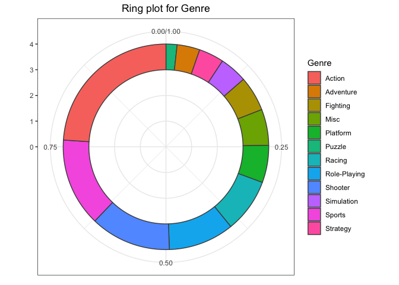<!-- -->

### Correlation between numeric variables

Before selecting our features for model building, it is important to know wheteher there is high correlation between our continuous variables. 


```r
# Take numeric variables as goal matrix
st <- game[, sapply(game, class) %in% c('numeric')]           
st <- na.omit(st)

library(ellipse)  
```

```
## 
## Attaching package: 'ellipse'
```

```
## The following object is masked from 'package:graphics':
## 
##     pairs
```

```r
library(corrplot)
```

```
## corrplot 0.90 loaded
```

```r
corMatrix <- cor(as.matrix(st))  # Correlation matrix
col <- colorRampPalette(c("#7F0000", "red", "#FF7F00", "yellow", "#7FFF7F",
                          "cyan", "#007FFF", "blue", "#00007F"))
corrplot.mixed(corMatrix, order = "AOE", lower = "number", lower.col = "black", 
               number.cex = .8, upper = "ellipse",  upper.col = col(10), 
               diag = "u", tl.pos = "lt", tl.col = "black")
```

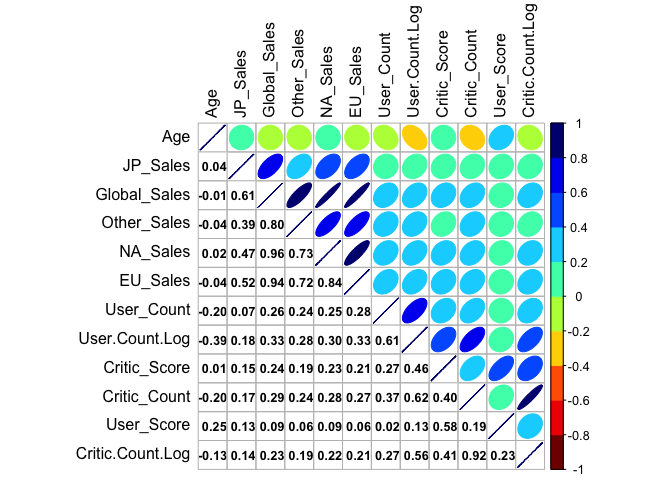<!-- -->

```r
plot(hclust(as.dist(1 - cor(as.matrix(st)))))  # Hierarchical clustering
```

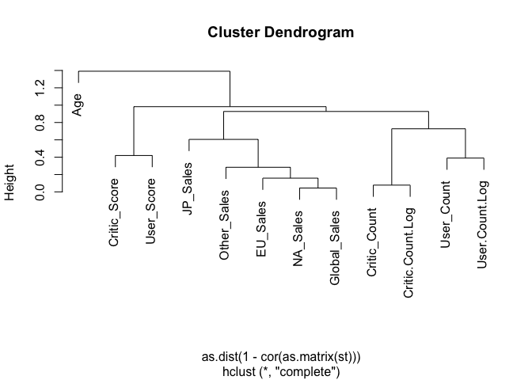<!-- -->

# Model Building

We can create a predictive model both in regression and classification. If we would like follow a classification approach, we can convert global sales into a binary variable, such as sales more than 1.000.000 and less. Nevertheless, I will demonstrate here a regression model since the main features are also continuous variables. 

I select three categorical variables and the rest are now numeric variables. 


```r
# final data 
final_data <- game %>%
        select( Age, Genre, Global_Sales,Critic_Score, Critic.Count.Log,
               User_Score, User.Count.Log, Rating, Platform.type)

glimpse(final_data)
```

```
## Rows: 6,947
## Columns: 9
## $ Age              <dbl> 12, 10, 9, 12, 12, 9, 13, 11, 8, 9, 5, 14, 13, 5, 16,…
## $ Genre            <chr> "Sports", "Racing", "Sports", "Platform", "Misc", "Pl…
## $ Global_Sales     <dbl> 82530000, 35520000, 32770000, 29800000, 28920000, 283…
## $ Critic_Score     <dbl> 7.6, 8.2, 8.0, 8.9, 5.8, 8.7, 9.1, 8.0, 6.1, 8.0, 9.7…
## $ Critic.Count.Log <dbl> 3.931826, 4.290459, 4.290459, 4.174387, 3.713572, 4.3…
## $ User_Score       <dbl> 8.0, 8.3, 8.0, 8.5, 6.6, 8.4, 8.6, 7.7, 6.3, 7.4, 8.2…
## $ User.Count.Log   <dbl> 5.774552, 6.563856, 5.257495, 6.066108, 4.859812, 6.3…
## $ Rating           <chr> "E", "E", "E", "E", "E", "E", "E", "E", "E", "E", "M"…
## $ Platform.type    <chr> "Nintendo", "Nintendo", "Nintendo", "Nintendo", "Nint…
```


### Data split

Tidymodels is my favorite in modeling and all this process is mainly based on tidymodel functions. Here the split ratio is 0.25 vs 0.75. 


```r
set.seed(1234)
data_split <- initial_split(final_data,
                            prop = 0.75,
                            strata = Global_Sales) # outcome
# Create training data
train_df <- data_split %>% training()
test_df <- data_split %>% testing()

dim(train_df); dim(test_df)
```

```
## [1] 5208    9
```

```
## [1] 1739    9
```

### Recipe

I use very basic recipe model here. We convert all character column into dummy variables, I impute missing values in age (122 NAs), normalize the variables and finally take the log of our outcome variable since it is also skewed. 


```r
recete <- recipe(Global_Sales ~ ., train_df) %>% 
        
        # One-hot encoding of categorical variables
        step_dummy(all_nominal()) %>%
        
        # impute missings
        step_knnimpute(Age) %>%
    
         # Center and scale the variables
        step_normalize(all_numeric(), -all_outcomes()) %>%
        
        # Normalize the outcome variable
        step_log(Global_Sales) 
```

```
## Warning: `step_knnimpute()` was deprecated in recipes 0.1.16.
## Please use `step_impute_knn()` instead.
## This warning is displayed once every 8 hours.
## Call `lifecycle::last_lifecycle_warnings()` to see where this warning was generated.
```

```r
recipe_prepped <- prep(recete)
df_train <- bake(recipe_prepped, new_data = train_df)
dim(df_train)
```

```
## [1] 5208   24
```

```r
df_test <- recipe_prepped %>% 
        bake(test_df)

dim(df_test)
```

```
## [1] 1739   24
```

### Correlation matrix

Since we do not have so much variable, I did not include a code in recipe to directly remove highly correlated variables. For that reason, it is wise to check whether there is a high correlation among our variables. 


```r
library(corrr)

corr_df <- df_train %>% select(is.numeric) %>% 
        correlate() %>%
        rearrange() %>% 
        shave()
```

```
## Warning: Predicate functions must be wrapped in `where()`.
## 
##   # Bad
##   data %>% select(is.numeric)
## 
##   # Good
##   data %>% select(where(is.numeric))
## 
## ℹ Please update your code.
## This message is displayed once per session.
```

```
## 
## Correlation method: 'pearson'
## Missing treated using: 'pairwise.complete.obs'
```

```r
rplot(corr_df,) +
        theme_minimal() +
        theme(axis.text.x = element_text(angle = 90)) +
        scale_colour_viridis_c()
```

```
## Scale for 'colour' is already present. Adding another scale for 'colour',
## which will replace the existing scale.
```

```
## Don't know how to automatically pick scale for object of type noquote. Defaulting to continuous.
```

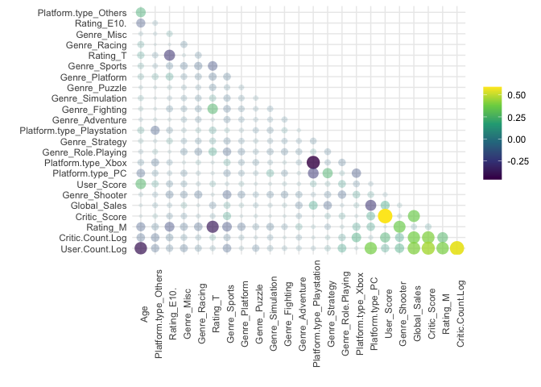<!-- -->


### Validation

To increase the mode performance and validation, I will use 10 fold validation procedure. I also use parallel processing to speed up the analysis 


```r
########### validation folds

k_folds <- vfold_cv(train_df)


############### do paralel

library(parallel)
library(doParallel)
```

```
## Loading required package: foreach
```

```
## 
## Attaching package: 'foreach'
```

```
## The following objects are masked from 'package:purrr':
## 
##     accumulate, when
```

```
## Loading required package: iterators
```

```r
cluster <- makeCluster(detectCores() - 1) # convention to leave 1 core for OS
registerDoParallel(cluster)
```

# Models

Here I will use four models. After checking their results, I will pick the best model for tuning. 


### Linear Model


```r
lm_model <- linear_reg() %>% 
        set_engine("lm")


lm_wf <-
        workflow() %>%
        add_recipe(recete) %>%
        add_model(lm_model)

set.seed(123)
lm_fit <-
        lm_wf %>%
        fit_resamples(resamples =k_folds)

lm_fit %>%
        collect_metrics()
```

```
## # A tibble: 2 × 6
##   .metric .estimator  mean     n std_err .config             
##   <chr>   <chr>      <dbl> <int>   <dbl> <chr>               
## 1 rmse    standard   0.980    10  0.0131 Preprocessor1_Model1
## 2 rsq     standard   0.509    10  0.0125 Preprocessor1_Model1
```

```r
set.seed(123)
lm_last_fit <-
        lm_wf %>%
        last_fit(split =data_split)


results_lm <- lm_last_fit %>% 
        collect_metrics()

lm_last_fit %>%
        collect_predictions() %>%
        ggplot(aes(.pred, Global_Sales)) +
        geom_abline(col = "green", lty = 2) +
        geom_point(alpha = .4, colour = "midnightblue") +
        annotate("text", x = Inf, y = Inf, hjust = 1.5, vjust = 2.5, 
                 label = paste("RMSE: ", round(results_lm$.estimate[1], 4))) +
        labs(title = "Linear regression model",
             subtitle = "Variety of steps in recipe, glmnet engine") 
```

<!-- -->


### Lasso with penalization


```r
glm_model <-
        linear_reg(penalty = 0.001, mixture = 0.5) %>%
        set_engine("glmnet")


glm_wf <-
        workflow() %>%
        add_recipe(recete) %>%
        add_model(glm_model)

set.seed(123)
glm_fit <-
        glm_wf %>%
        fit_resamples(resamples =k_folds)

glm_fit %>%
        collect_metrics()
```

```
## # A tibble: 2 × 6
##   .metric .estimator  mean     n std_err .config             
##   <chr>   <chr>      <dbl> <int>   <dbl> <chr>               
## 1 rmse    standard   0.980    10  0.0131 Preprocessor1_Model1
## 2 rsq     standard   0.509    10  0.0125 Preprocessor1_Model1
```

```r
set.seed(123)
glm_last_fit <-
        glm_wf %>%
        last_fit(split =data_split)


results_glm <- glm_last_fit %>% 
        collect_metrics()

glm_last_fit %>%
        collect_predictions() %>%
        ggplot(aes(.pred, Global_Sales)) +
        geom_abline(col = "green", lty = 2) +
        geom_point(alpha = .4, colour = "midnightblue") +
        annotate("text", x = Inf, y = Inf, hjust = 1.5, vjust = 2.5, 
                 label = paste("RMSE: ", round(results_glm$.estimate[1], 4))) +
        labs(title = "Lasso regression model",
             subtitle = "Variety of steps in recipe, glmnet engine") 
```

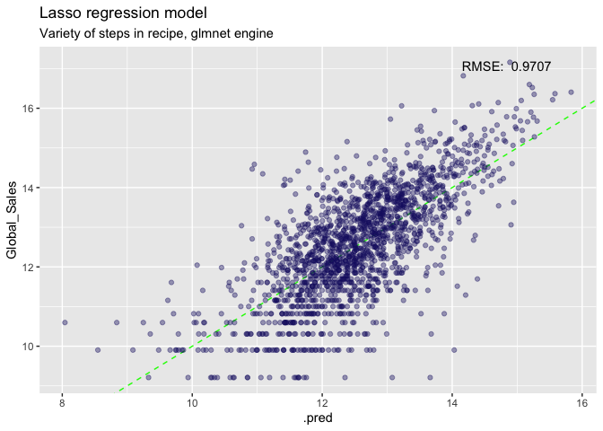<!-- -->


### Random Forest


```r
# model
rf_model <-
        rand_forest() %>%
        set_engine("ranger") %>%
        set_mode("regression")
# workflow
rf_wf <-
        workflow() %>%
        add_recipe(recete) %>%
        add_model(rf_model)

summary(rf_wf)
```

```
##         Length Class      Mode   
## pre     2      stage_pre  list   
## fit     2      stage_fit  list   
## post    1      stage_post list   
## trained 1      -none-     logical
```

```r
# model fit
set.seed(123)
rf_fit <-
        rf_wf %>%
        fit_resamples(resamples = k_folds)
# metrics
rf_fit %>%
        collect_metrics()
```

```
## # A tibble: 2 × 6
##   .metric .estimator  mean     n std_err .config             
##   <chr>   <chr>      <dbl> <int>   <dbl> <chr>               
## 1 rmse    standard   0.931    10  0.0127 Preprocessor1_Model1
## 2 rsq     standard   0.570    10  0.0131 Preprocessor1_Model1
```

```r
# last fit
set.seed(123)
rf_last_fit <-
        rf_wf %>%
        last_fit(split = data_split)

# metrics
rf_results <- rf_last_fit %>% 
        collect_metrics()

# plot
rf_last_fit %>%
        collect_predictions() %>%
        ggplot(aes(.pred, Global_Sales)) +
        geom_abline(col = "green", lty = 2) +
        geom_point(alpha = .4, colour = "midnightblue") +
        annotate("text", x = Inf, y = Inf, hjust = 1.5, vjust = 2, 
                 label = paste("RMSE: ", round(rf_results$.estimate[1], 4))) +
        labs(title = "Random tree model",
             subtitle = "No hyperparameters tuned, ranger engine") 
```

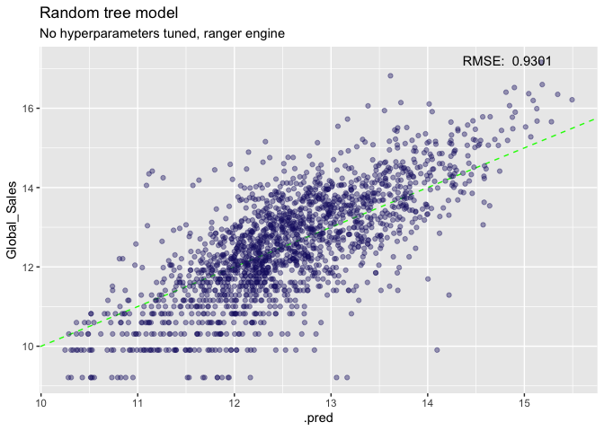<!-- -->


###  XGB Model


```r
xgb_model <-
        boost_tree(
                mode = "regression",
                trees = 500,
                learn_rate = 0.1,
                min_n = 11,
                tree_depth = 8
        ) %>%
        set_engine(
                "xgboost",
                booster = "gbtree"
        )

# workflow
xgb_wf <-
        workflow() %>%
        add_recipe(recete) %>%
        add_model(xgb_model)

summary(xgb_wf)
```

```
##         Length Class      Mode   
## pre     2      stage_pre  list   
## fit     2      stage_fit  list   
## post    1      stage_post list   
## trained 1      -none-     logical
```

```r
####### model fit
set.seed(123)
xgb_fit <-
        xgb_wf %>%
        fit_resamples(resamples = k_folds)
# metrics
xgb_fit %>%
        collect_metrics()
```

```
## # A tibble: 2 × 6
##   .metric .estimator  mean     n std_err .config             
##   <chr>   <chr>      <dbl> <int>   <dbl> <chr>               
## 1 rmse    standard   0.941    10  0.0133 Preprocessor1_Model1
## 2 rsq     standard   0.554    10  0.0127 Preprocessor1_Model1
```

```r
# last fit
set.seed(123)
xgb_last_fit <-
        xgb_wf %>%
        last_fit(split = data_split)

# metrics
xgb_results <- xgb_last_fit %>% 
        collect_metrics()

# plot
xgb_last_fit %>%
        collect_predictions() %>%
        ggplot(aes(.pred, Global_Sales)) +
        geom_abline(col = "green", lty = 2) +
        geom_point(alpha = .4, colour = "midnightblue") +
        annotate("text", x = Inf, y = Inf, hjust = 1.5, vjust = 2, 
                 label = paste("RMSE: ", round(xgb_results$.estimate[1], 4))) +
        labs(title = "XGB model",
             subtitle = "No hyperparameters tuned, ranger engine") 
```

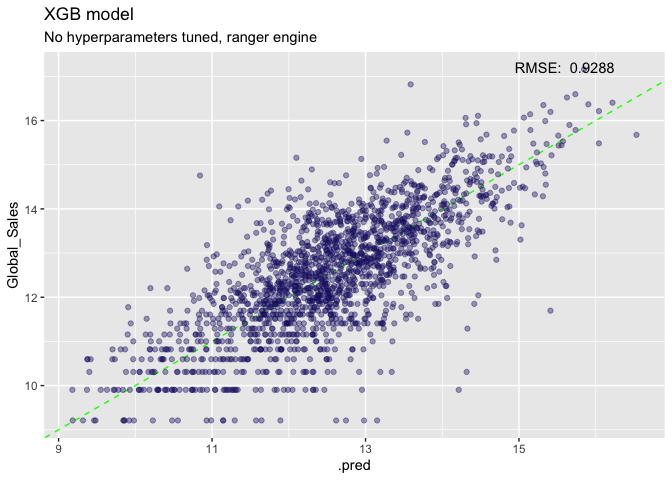<!-- -->


## Compare models


```r
##### comparing rmse and rsq
lm_score <-  lm_fit %>%
        collect_metrics() %>%
        mutate(model= "lm")

glm_score <-  glm_fit %>%
        collect_metrics()%>%
        mutate(model= "glm")

rf_score <-  rf_fit %>%
        collect_metrics()%>%
        mutate(model= "rf")

xgb_score <-  xgb_fit %>%
        collect_metrics()%>%
        mutate(model= "xgb")

score_table <- bind_rows(lm_score, glm_score, rf_score, xgb_score) %>%
        select(-.config)

score_table %>%
        filter(.metric=="rmse") %>%
        ggplot( aes(x= mean, y= reorder(model, mean)))+
        geom_bar(stat = "identity") +
        theme_bw()+
        labs(y= "Models",
             x= "RMSE means")
```

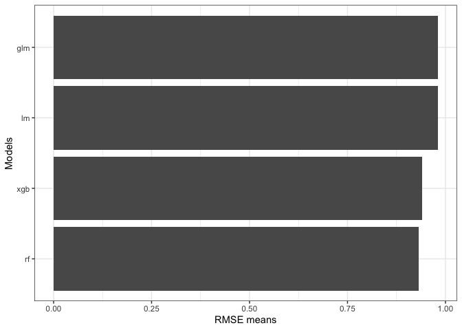<!-- -->

```r
############ graph 
# Extract metrics from our models to compare them:
lm_metrics <- 
        lm_last_fit %>%
        collect_predictions() %>%
        rename("lm" = .pred) %>%
        select("lm")

glm_metrics <- 
        glm_last_fit %>%
        collect_predictions() %>%
        rename("glmnet" = .pred) %>%
        select("glmnet")


rf_metrics <- 
        rf_last_fit %>%
        collect_predictions() %>%
        rename("rf" = .pred) %>%
        select("rf")


xgb_metrics <- 
        xgb_last_fit %>%
        collect_predictions() %>%
        rename("xgb" = .pred) %>%
        select("xgb")


model_compare <- 
        rf_last_fit%>%
        collect_predictions() %>%
        bind_cols(
                glm_metrics,
                rf_metrics,
                lm_metrics,
                xgb_metrics
) %>%
select(-id, -.pred, -.row)


model_compare %>%   pivot_longer(
                        cols = c(glmnet, rf,lm , xgb),
                         names_to = "model",
                         values_to = "prediction") %>%
        select(-.config)
```

```
## # A tibble: 6,956 × 3
##    Global_Sales model  prediction
##           <dbl> <chr>       <dbl>
##  1         17.2 glmnet       14.9
##  2         17.2 rf           15.2
##  3         17.2 lm           14.9
##  4         17.2 xgb          15.8
##  5         16.8 glmnet       14.2
##  6         16.8 rf           13.6
##  7         16.8 lm           14.2
##  8         16.8 xgb          13.6
##  9         16.6 glmnet       15.2
## 10         16.6 rf           15.2
## # … with 6,946 more rows
```

```r
model_compare %>%
        pivot_longer(
                cols = c(glmnet,lm, rf, xgb  ),
                names_to = "model",
                values_to = "prediction") %>%
        select(-.config) %>%
        ggplot(aes(prediction, Global_Sales)) +
        geom_abline(col = "green", lty = 2) +
        geom_point(col = "midnightblue", alpha = .7) +
        facet_wrap(~model) +
        theme_bw() +
        coord_fixed()
```

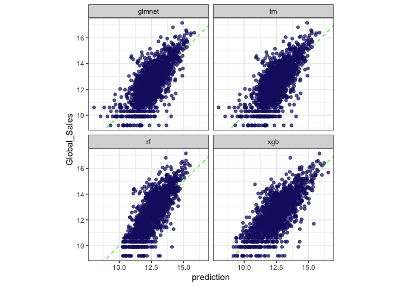<!-- -->

Our results show that Random Forest model provides better results, with a lower rmse and higher R square scores. 

# Tuning

We can tune random RF model to improve the model. 


```r
set.seed(256)
rf_mod <- 
        rand_forest(trees = 500,
                    mtry = tune(),
                    min_n = tune()) %>% 
        set_engine("ranger", importance = "impurity",
                   num.threads = 12) %>% 
        set_mode("regression")

#Establish Model Flow
tune_wf <- workflow() %>%
        add_recipe(recete) %>%
        add_model(rf_mod)

#Generate grid to perform grid search for hyper parameter optimization
rf_grid <- grid_regular(mtry(range = c(6,10)), 
                        min_n(range = c(14,20)), 
                        levels = c(10,9))

# 10-fold Cross Validation Stratified by Global_Sales
folds <- vfold_cv(train_df, v = 10, strata = Global_Sales)

#Train and evaluate all combinations of hyperparameters 
# specified in rf_grid
doParallel::registerDoParallel(cores = 12)

rf_grid_search <- tune_grid(
        tune_wf,
        resamples = folds,
        grid = rf_grid)
```

### tuning results


```r
rf_grid_search %>%
        collect_metrics() %>% 
        filter(.metric == "rmse") %>%
        select(mean, min_n, mtry) %>%
        filter(mtry > 4) %>% 
        ggplot(aes(min_n, mean, color = as_factor(mtry))) +
        geom_point()+
        geom_line()+
        scale_color_viridis_d() +
        theme_minimal()+
        scale_x_continuous(breaks = pretty_breaks())+
        theme(legend.position = "bottom") +
        labs(x = "Minimum Number of Observations to Split Node",
             y = "RMSE", 
             title = "Grid Search Results for Random Forest",
             color = "Number of Predictors Sampled at Each Split")
```

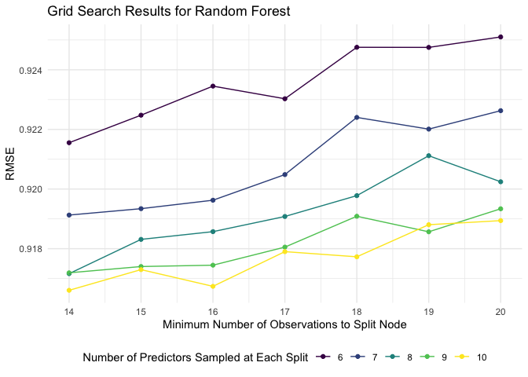<!-- -->

```r
# show best
rf_grid_search %>% show_best()
```

```
## Warning: No value of `metric` was given; metric 'rmse' will be used.
```

```
## # A tibble: 5 × 8
##    mtry min_n .metric .estimator  mean     n std_err .config              
##   <int> <int> <chr>   <chr>      <dbl> <int>   <dbl> <chr>                
## 1    10    14 rmse    standard   0.917    10 0.00864 Preprocessor1_Model05
## 2    10    16 rmse    standard   0.917    10 0.00852 Preprocessor1_Model15
## 3     8    14 rmse    standard   0.917    10 0.00850 Preprocessor1_Model03
## 4     9    14 rmse    standard   0.917    10 0.00862 Preprocessor1_Model04
## 5    10    15 rmse    standard   0.917    10 0.00866 Preprocessor1_Model10
```

```r
rf_best_rmse <- select_best(rf_grid_search, "rmse")

final_rf <- finalize_model(
        rf_mod,
        rf_best_rmse
)

final_rf
```

```
## Random Forest Model Specification (regression)
## 
## Main Arguments:
##   mtry = 10
##   trees = 500
##   min_n = 14
## 
## Engine-Specific Arguments:
##   importance = impurity
##   num.threads = 12
## 
## Computational engine: ranger
```

```r
final_rf %>%
        fit(Global_Sales ~., data = bake(prep(recete),training(data_split))) %>% 
        vip(geom=c("col"), num_features = 10) +
        theme_minimal()
```

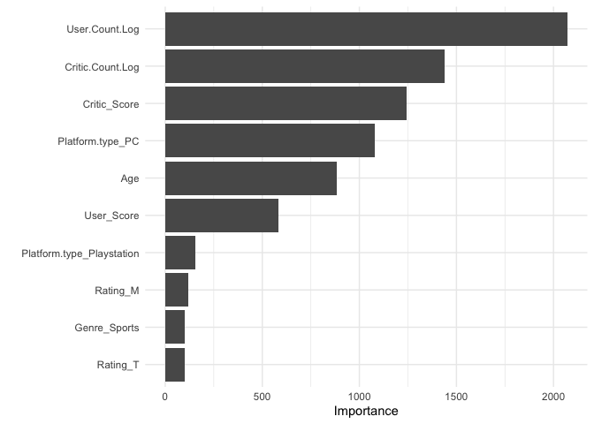<!-- -->

In the tuning process, I am able to reduce the rmse scores from 0.930 to 0.910 and keep the R square.  

### Final fit


```r
final_wf <- 
        workflow() %>% 
        add_recipe(recete) %>% 
        add_model(final_rf)

overallfit <-final_wf %>%
        tune::last_fit(data_split)


overallfit %>%
        collect_metrics()
```

```
## # A tibble: 2 × 4
##   .metric .estimator .estimate .config             
##   <chr>   <chr>          <dbl> <chr>               
## 1 rmse    standard       0.913 Preprocessor1_Model1
## 2 rsq     standard       0.570 Preprocessor1_Model1
```

```r
overallfit  %>%
        collect_predictions() %>%
        ggplot(aes(x= Global_Sales, y = .pred)) +
        geom_abline(col = "green", lty = 2, lwd= 2) +
        geom_point(alpha = .4, colour = "midnightblue") +
        theme_minimal()+
        labs(x="Game Sales",
             y= "Predicted Game Sales", 
             title = "Tuned Random Forest Regression")
```

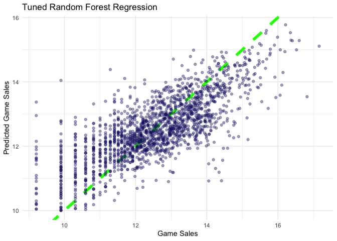<!-- -->

#### Summary

1. Our results show that user count is the most important variable in predicting global scales following by critic counts. It is a basic relationship actually, more games, more ratings and more critics you have. 

2. On the other hand, PC platforms constitute an important predictor. It might be due to ease of writing critics or sharing ratings online. The second platform types that explains variation is the Playstation, which also constitutes the main part of the user share. 

3. The age of the game is also an important variable. If people enjoy the game, the popularity and fame of the game increase during the time, which leads more sales.

4. Among genres, sports games have the leading role in contributing global game sales. T rating is also the most power rating scores explaining the variation. 

5. Finally, our model is fine to predict global game sales with these available features in data set. This model could be improve with further modification, particularly focusing on outliers. 


